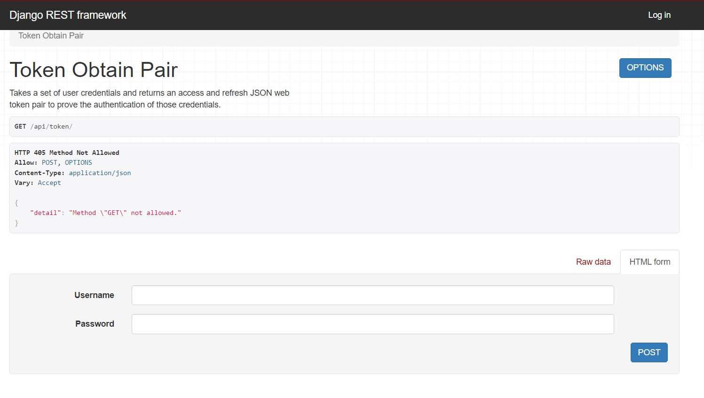
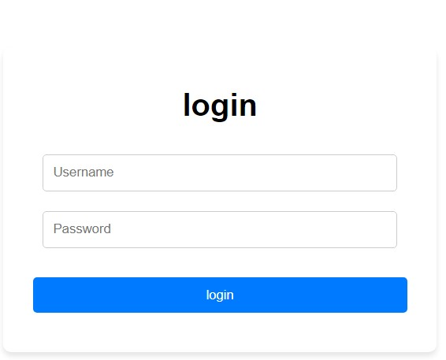
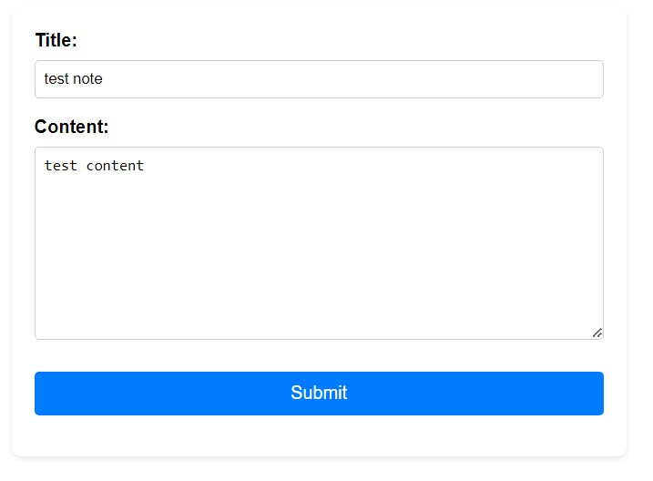

# Django & React Notes App

This is a full-stack application built with Django and React, allowing users to create, read, and delete notes. The project follows a RESTful API architecture and utilizes JSON Web Tokens (JWT) for authentication.

## Features

- User registration and authentication with JWT
- Create, read, and delete notes
- Responsive design with React and Bootstrap

## Backend (Django)

The backend is built with Django, a high-level Python web framework. It provides the following functionality:

### Key Components

- **Settings**: Configure Django settings, including JWT authentication and CORS.
- **Views**: Implement views for user registration, authentication, and CRUD operations on notes.
- **Models**: Define models for users and notes.
- **Serializers**: Serialize and deserialize data between Python objects and JSON.
- **URLs**: Define URL patterns for the API endpoints.

## Frontend (React)

The frontend is built with React, using Vite. It provides the following functionality:

### Key Components

- **Navigation**: Implement navigation with React Router.
- **Pages**: Define pages for login, registration, home, and 404 error.
- **Forms**: Create reusable form components for login and registration.
- **Notes**: Implement components for displaying, creating, and deleting notes.
- **Authentication**: Implement protected routes and handle JWT authentication.
- **Axios**: Use Axios for making API requests to the Django backend.